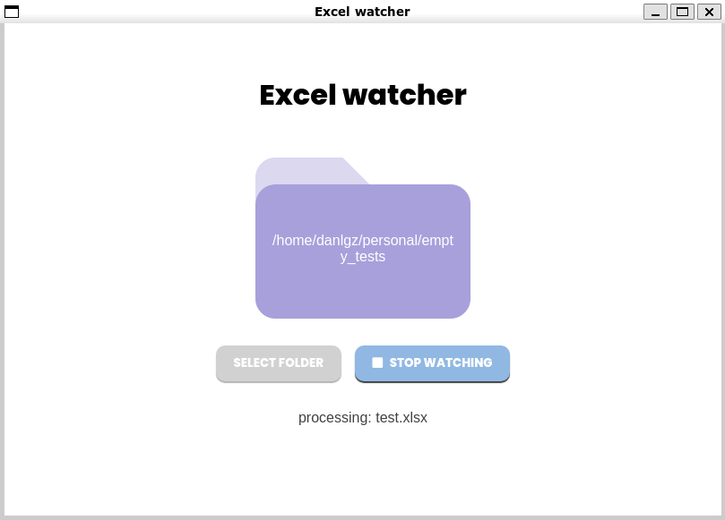

# Excel Watcher

[Demo](https://www.google.com/)

## Requirements
* Python 3.8.
* Chrome/Chromium browser.
* If you use a linux distribution, install `python3-tk` in your system. Ubuntu example: `sudo apt-get install python3-tk`.

## Setup
1. Create a Virtual Environment.
2. Run `pip install -r requierements.txt`.
3. Run `python start.py`.
